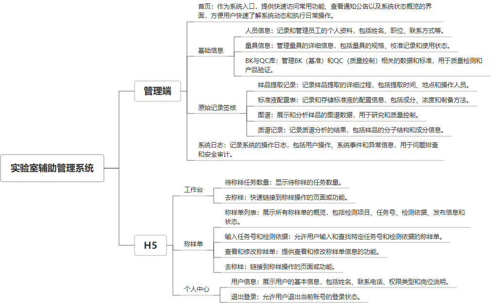

 

    
 

公司拥有上百套具有自主知识产权的软件系统，详情请查看码云首页或公司官网

 
<h1>实验室辅助系统</h1>

<a href="https://www.haishi.net.cn/">公司官网</a> ｜ <a href="https://www.haishi.net.cn/">在线体验</a>

 

## 系统介绍

实验室实验数据检测、记录系统，适用于小型实验室，包含：基础信息、人员、量具、BK与QC库、原始记录核签、图谱、质谱等，包含有小程序辅助使用。
实验室实验数据检测、记录系统，适用于小型实验室，包含：基础信息、人员、量具、BK与QC库、原始记录核签、图谱、质谱等，包含有小程序辅助使用。
本项目名称为实验室辅助管理系统，是实验室用于记录、管理、分析实验数据的系统。该系统旨在提高实验室工作效率，减少人工操作误差，并为实验室管理提供数据支持。
本项目从用户层面可以分为两个端：Web管理端、H5移动端
- Web管理端：实验室人员使用，功能包括：人员信息管理、量具信息管理、BK与QC库管理、原始记录签核、系统日志查看等
- H5移动端：实验室人员使用，功能包括：工作台、称样单、我的等
                

## 系统功能介绍

### 系统包含终端说明

管理端（WEB）、用户端（微信小程序）

| 序号 | 模块 | 模块说明 |
| --- | --- | --- |
| 1 | GC-SYSFZ-XX-SERVER | 服务端 |
| 2 | GC-SYSFZ-XX-H5 | H5端 |
| 3 | GC-SYSFZ-XX-MANAGE | 管理端 |

### 系统功能结构

### 系统功能说明

- 原始记录签核：对实验室的样品提取记录、标准液配置表、图谱、质谱记录进行电子化签核
- BK与QC库管理：对实验室的BK与QC库进行管理
- 量具信息管理：对实验室的量具信息进行管理，例如：量具名称、规格型号、检定日期等
- 人员信息管理：对实验室的人员信息进行管理，例如：姓名、性别、部门、职位等

## 系统主要界面

## 系统技术说明

### 代码模块说明

| 序号 | 目录 | 目录说明 |
| --- | --- | --- |
| 1 | GC-SYSFZ-XX-SERVER/src | -- |

### 系统技术选型

#### 开发语言/框架

JAVA（JDK1.8）
前端框架：VUE2

#### 服务中间件

Nginx

#### 数据库

MySQL（5.7+）

#### 其他说明

无

## 系统演示/商用

请扫码添加客服微信获取演示地址和系统详细资料。

如果您想基于实验室辅助系统进行商业化交付或定制开发服务，我们提供有偿的技术服务支持，合作模式不限，欢迎沟通！

公司官网地址： <a href="https://www.haishi.net.cn/">https://www.haishi.net.cn</a>

联系客服获取专业回答。

## 使用须知

1、 本项目商用必须获得版权所有者的授权。

2、 未经允许本项目代码不允许二次出售。

